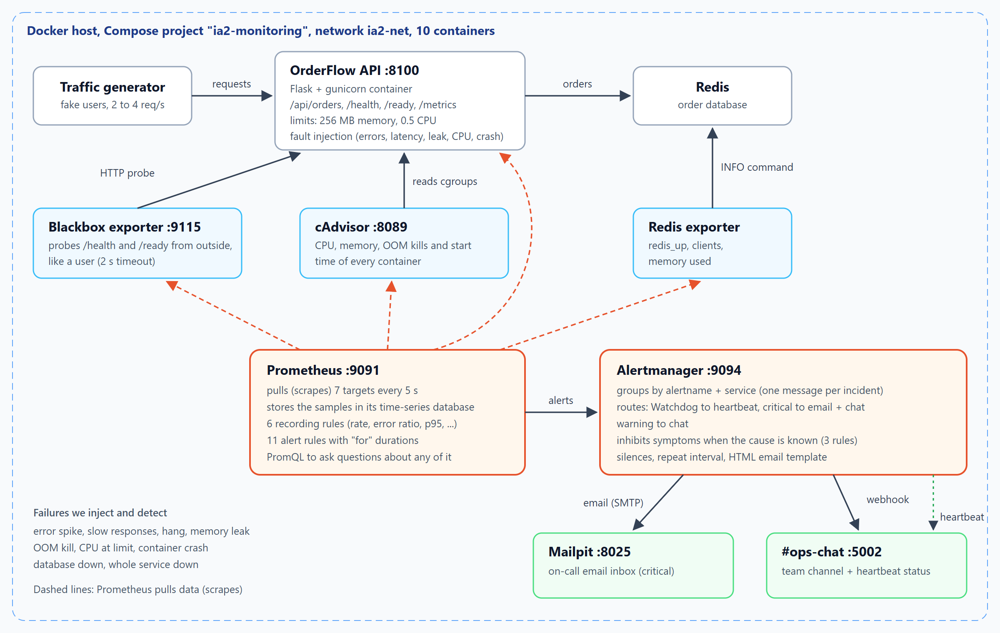

# Automated Failure Detection & Alert Notification for Containerized Applications

**DevOps IA-2 case study · Tool: Prometheus and Alertmanager**

| Name | Roll no. |
|---|---|
| Yashasvi Gupta | 16010123341 |
| Shweta Karandikar | 16010123329 |
| Aditi Agrawal | 16010123018 |

Division faculty: SCP

---

A containerized web service (OrderFlow, a small order-taking API backed by
Redis) runs next to a complete Prometheus + Alertmanager setup. We break the
service in nine different ways (error spikes, slowness, hangs, memory leaks,
OOM kills, CPU exhaustion, crashes, a database outage, a full outage) and
show each failure being detected and turned into an email and a chat message
within about a minute, with related alerts grouped and side effects
suppressed. A script measures the detection time of every scenario so the
tool can be evaluated with numbers rather than impressions.



## What runs

`docker compose up -d --build` starts ten containers:

| Container | Port | Role |
|---|---|---|
| `ia2-shop-api` | 8100 | OrderFlow, the application being monitored (Flask, limited to 256 MB and 0.5 CPU) |
| `ia2-redis` | – | Its database |
| `ia2-traffic` | – | Fake users, so error rate and latency mean something |
| `ia2-prometheus` | 9091 | Scrapes every target every 5 s, evaluates the rules |
| `ia2-alertmanager` | 9094 | Groups, routes, inhibits and sends notifications |
| `ia2-blackbox` | 9115 | Probes `/health` and `/ready` from outside, like a user |
| `ia2-cadvisor` | 8089 | CPU, memory, OOM kills and restarts of every container |
| `ia2-redis-exporter` | – | Turns Redis stats into Prometheus metrics |
| `ia2-mailpit` | 8025 | Catches the on-call emails and shows them in a web inbox |
| `ia2-ops-chat` | 5002 | A Slack-like channel that receives webhook alerts and the heartbeat |

Open http://localhost:8100 for the app and its fault-injection buttons,
http://localhost:9091/alerts for Prometheus, http://localhost:9094 for
Alertmanager, http://localhost:8025 for the email inbox and
http://localhost:5002 for the chat channel.

## Three kinds of monitoring

1. **White-box.** The app exposes `/metrics`: request counts by route and
   status, a latency histogram, orders created, dependency status.
2. **Black-box.** The blackbox exporter calls `/health` and `/ready` like a
   user would. This catches what white-box metrics miss: a process that is
   running but hangs.
3. **Container-level.** cAdvisor reports what Docker gives each container
   (memory against its limit, CPU against its quota, OOM kills, restarts)
   for any container, instrumented or not.

## Alert rules

| Alert | Condition | Severity | Goes to |
|---|---|---|---|
| `ServiceDown` | `up == 0` for 30 s | critical | email + chat |
| `EndpointDown` | black-box probe of `/health` fails for 40 s | critical | email + chat |
| `DependencyDown` | `redis_up == 0` for 15 s | critical | email + chat |
| `HighErrorRate` | more than 10% of requests return 5xx, for 30 s | critical | email + chat |
| `ContainerOOMKilled` | the kernel killed a process for using too much memory | critical | email + chat |
| `ServiceNotReady` | `/ready` probe fails for 45 s | warning | chat |
| `HighLatencyP95` | p95 latency above 500 ms for 1 min | warning | chat |
| `ContainerMemoryNearLimit` | memory above 80% of the container's limit for 15 s | warning | chat |
| `ContainerCPUThrottled` | throttled in more than half of CPU periods for 30 s | warning | chat |
| `ContainerRestarted` | a container started again in the last 5 min | warning | chat |
| `Watchdog` | always firing (dead man's switch) | none | heartbeat |

Six **recording rules** pre-compute request rate, error ratio, p95 latency, CPU throttling
and memory and CPU use relative to the container limits.

## What Alertmanager adds

- **Routing:** critical alerts are emailed to on-call *and* posted to the
  chat (`continue: true`); warnings go to the chat only.
- **Grouping:** alerts are bundled by `alertname` and `service`, with a short
  wait so related alerts arrive in one message.
- **Inhibition:** when the cause is known, its symptoms are held back.
  `DependencyDown` hides the error spike and "not ready" it causes;
  `ServiceDown` hides the failed probes; `EndpointDown` hides the latency it
  causes.
- **Heartbeat:** the `Watchdog` alert always fires and reaches the chat page
  about once a minute. If it stops, the alerting pipeline itself is broken,
  and the page says so.
- **Templates:** `monitoring/alertmanager/templates/email.tmpl` builds the
  subject line (`[FIRING x1] HighErrorRate on shop-api`) and an HTML email
  with summary, details and what to do.

## Breaking things on purpose

Use the buttons on http://localhost:8100, or the script:

```powershell
.\scripts\chaos.ps1 errors     # also: slow, hang, leak, oom, cpu, crash, db-down, app-down, reset
```

Measured on our machine with `python scripts/measure_detection.py`
(time from injecting the fault to the notification arriving):

| Failure injected | Alert | Severity | Ops chat | On-call email | Resolved after fix |
|---|---|---|---|---|---|
| API error spike (50% of requests fail) | `HighErrorRate` | critical | 64 s | 59 s | 57 s |
| Slow responses (1.5 s per request) | `HighLatencyP95` | warning | 90 s | – | 56 s |
| App hangs (3 s, health probe times out) | `EndpointDown` | critical | 60 s | 55 s | 26 s |
| Memory leak up to ~85% of the limit | `ContainerMemoryNearLimit` | warning | 72 s | – | 26 s |
| CPU burn (container at its CPU limit) | `ContainerCPUThrottled` | warning | 76 s | – | 56 s |
| Database outage (docker stop ia2-redis) | `DependencyDown` | critical | 32 s | 27 s | 26 s |
| Out of memory (fast leak, kernel OOM kill) | `ContainerOOMKilled` | critical | 31 s | 26 s | 296 s ¹ |
| Container crash (process exits) | `ContainerRestarted` | warning | 16 s | – | – ² |
| Whole service down (docker stop ia2-shop-api) | `ServiceDown` | critical | 52 s | 47 s | 27 s |

¹ `ContainerOOMKilled` looks at OOM events over the last 5 minutes, so it stays visible for 5 minutes after the kill by design.  
² A restart is a one-off event; the alert clears by itself 5 minutes later.

A 10-second outage sent **no** critical page (the `for: 30s` rule at work).

The full output is in [`docs/results`](docs/results).

## Tests and CI

- `app/tests`: 20 pytest tests for the service and the fault injection.
- `monitoring/prometheus/tests/alert_rules_test.yml`: promtool unit tests for
  the rules, including one proving that a 10-second blip does **not** alert.
- `monitoring/ops-chat/test_receiver.py`: tests for the chat receiver.
- GitHub Actions runs all of the above, checks the Alertmanager routing with
  `amtool`, then starts the whole stack, injects errors and waits for the
  alert to arrive in both the chat and the email inbox.

## Repository layout

```
app/                     OrderFlow service, tests, Dockerfile
traffic/                 traffic generator
monitoring/prometheus/   prometheus.yml, rules/, tests/
monitoring/alertmanager/ alertmanager.yml, templates/
monitoring/blackbox/     probe settings
monitoring/ops-chat/     webhook receiver (chat + heartbeat)
scripts/                 chaos.ps1 / chaos.sh, measure_detection.py
docs/                    case study report, screenshots, results
```

## Useful PromQL to try in Prometheus

```promql
service:http_requests:rate1m                     # requests per second
service:http_errors:ratio_rate1m                 # share of failed requests
service:http_request_duration_seconds:p95_1m     # p95 latency
container:memory_working_set:ratio_limit         # memory vs limit, per container
probe_success                                    # black-box probe results
ALERTS{alertstate="firing"}                      # what is firing right now
```

## Troubleshooting

- **Port already in use:** change the left side of the port in `docker-compose.yml`.
- **No alert yet:** check http://localhost:9091/alerts. *Pending* means the
  `for` timer is still running.
- **Edited a rule?** `curl -X POST localhost:9091/-/reload` reloads Prometheus
  without a restart (`localhost:9094/-/reload` for Alertmanager).
- **cAdvisor shows nothing:** it needs `privileged` and the host mounts in
  `docker-compose.yml`; on Docker Desktop it works as configured.
