# 1. Abstract

Containers fail in subtle ways that traditional infrastructure monitoring frequently misses: a web process hangs while its container status remains "Up", memory leaks gradually until the Linux kernel terminates the process, or a backend database dies while the web API keeps returning internal server errors. This case study evaluates **Prometheus** and **Alertmanager** as an automated observability and incident notification stack for containerized microservices. 

We built **OrderFlow**, a containerized food ordering service backed by a Redis database, and encapsulated it within a ten-container production-grade monitoring architecture: white-box application metrics, black-box HTTP probing, kernel-level container metrics via cAdvisor, a dedicated Redis exporter, Prometheus with recording and alerting rules, and Alertmanager routing notifications to an on-call email inbox and an operations chat webhook. 

We systematically injected nine real-world container failure modes and evaluated detection latency, notification routing, and noise suppression. All nine failures were detected automatically: first notifications arrived between 16 and 90 seconds after fault onset (median 60 seconds), with critical alerts reaching the on-call engineer's inbox in 26 to 59 seconds. Alertmanager's inhibition mechanism suppressed cascade alerts during a database outage, reducing four potential alarm floods to a single actionable root-cause page, while a 10-second transient blip produced zero false alarms. We compare Prometheus and Alertmanager against Nagios, Zabbix, Datadog, Grafana Alerting, and AWS CloudWatch, and discuss their operational trade-offs.

# 2. Introduction

## 2.1 The problem

Modern microservices architectures make deploying containerized applications straightforward, but they also make failures quiet and difficult to diagnose. Consider an online food delivery platform like **OrderFlow**. Day and night, hungry customers place orders that must be processed immediately. At 2:00 AM, a critical dependency or worker process fails silently. Customers continue placing orders that never reach the restaurant, money is deducted, and the engineering team only learns about the catastrophe hours later when customer complaints flood support channels.

Containers make this nightmare especially easy to overlook because Docker CLI tools such as `docker ps` can still report a container as *Up* (running) while inside:

- **The web process hangs:** Incoming requests block indefinitely and user connections time out, yet the container process exists.
- **A critical dependency crashes:** Redis fails or becomes unreachable, causing order creation to fail with HTTP 500 errors.
- **Memory leaks accumulate:** Application memory gradually expands until the Linux kernel's Out-Of-Memory (OOM) killer abruptly kills the process.
- **CPU quota is saturated:** High compute loads hit CPU quotas and cause heavy thread throttling, severely degrading user latency.
- **Containers crash and restart silently:** The process crashes and Docker restarts it immediately, hiding a recurring underlying defect.

An engineering team requires an automated monitoring architecture that notices these failures within approximately one minute, notifies the correct engineer without requiring anyone to stare at dashboards, prevents alert fatigue by suppressing symptom storms, and confirms resolution when services recover.

## 2.2 Objectives

1. **Tool Justification:** Select an open-source monitoring and alerting stack suited for dynamic containerized workloads and justify the choice.
2. **Multi-Angle Observability:** Instrument OrderFlow from three complementary monitoring perspectives: white-box metrics, black-box health probing, and container-level cgroup metrics.
3. **Automated Alert Rules:** Author expressive PromQL alert rules for all major failure modes and test them systematically via automated unit testing.
4. **Noise Reduction & Multi-Channel Routing:** Configure Alertmanager with grouping, inhibition, silence handling, and a watchdog heartbeat delivering critical alerts to email and chat.
5. **Empirical Chaos Evaluation:** Inject nine real failure scenarios, benchmark exact time-to-detect and recovery durations, and compare the solution against industry alternatives.

# 3. Tool selection

## 3.1 What we needed

| Requirement | Why it matters |
|---|---|
| Native container compatibility | Containers are ephemeral; static host lists cannot keep up |
| Multi-dimensional metrics with labels | Ability to compute rates, percentiles, and ratios rather than simple up/down checks |
| Expressive alert conditions | Fine-grained logic such as "HTTP error ratio > 10% sustained for 30 seconds" |
| Noise suppression & routing | Distinct delivery channels by severity, symptom inhibition, and de-duplication |
| Configuration as code | Alert rules and routing version-controlled in Git and verified in CI |
| Free and self-hosted | Lightweight footprint capable of running locally or on edge nodes without recurring SaaS costs |

## 3.2 Candidates

We evaluated Nagios Core, Zabbix, Datadog, Grafana Alerting, AWS CloudWatch, and Prometheus paired with Alertmanager (detailed comparison in Section 6.5). Commercial SaaS offerings like Datadog and AWS CloudWatch incur per-host or per-metric billing and introduce vendor lock-in. Nagios Core is centered around static physical hosts and lacks native container discovery. Zabbix is powerful but traditionally configured through a manual web interface backed by a relational database. Grafana Alerting offers strong visualization but relies on an external data collection engine like Prometheus.

## 3.3 Why Prometheus and Alertmanager

- **Cloud-Native Design:** Prometheus is a CNCF graduated project built ground-up for microservices and dynamic container environments, featuring native Docker and Kubernetes service discovery.
- **Expressive PromQL Engine:** A unified query language powering dashboards, recording rules, and alerts that natively evaluates moving averages, percentile latencies, and container resource limits.
- **Separation of Concerns with Alertmanager:** Prometheus detects *what* is broken, while Alertmanager manages *how* and *to whom* alerts are delivered via grouping, inhibition, silences, and multi-receiver routing.
- **Monitoring as Code:** Configuration and alert rules are defined in declarative YAML, allowing automated linting and unit testing with `promtool` and `amtool` inside CI/CD pipelines.
- **Resource Efficiency:** Fully open-source (Apache 2.0) with an ultra-lightweight operational footprint (~180 MiB RAM for the entire monitoring stack).

# 4. Understanding the tool

## 4.1 Prometheus

Prometheus operates primarily via a **pull model**: at configured scrape intervals (5 seconds in our stack), the Prometheus server initiates HTTP GET requests to each target's `/metrics` endpoint. If a target fails to answer within the scrape timeout, Prometheus automatically registers `up = 0`, making scrape failures a first-class alerting signal.

Every metric sample consists of a timestamp, a float64 value, and multi-dimensional key-value labels:

```
http_requests_total{route="/api/orders", status="500", method="POST"} 142
```

Metrics are persisted in Prometheus's append-only **time-series database** (TSDB). Third-party services that do not natively provide Prometheus endpoints are monitored using dedicated **exporters** that bridge native telemetry into Prometheus metrics:

| Metric Type | Operational Behavior | Example in OrderFlow |
|---|---|---|
| **Counter** | Monotonically increasing value; queried via `rate()` or `increase()` | `http_requests_total`, `orders_created_total` |
| **Gauge** | Value that fluctuates up and down | `app_dependency_up`, `container_memory_working_set_bytes` |
| **Histogram** | Samples observations into cumulative buckets | `http_request_duration_seconds` (calculates p95 latency) |

**Recording rules** precompute expensive PromQL queries on a schedule and persist the results as new time series, optimizing query performance. **Alerting rules** specify a PromQL condition combined with a `for` duration: when the condition evaluates to true, the alert enters the *pending* state; once it remains continuously true for the duration, it transitions to *firing* and is pushed to Alertmanager.

## 4.2 Alertmanager

Alertmanager ingests alerts from one or more Prometheus instances and processes them through an ordered pipeline:

1. **Inhibition:** Suppresses symptom alerts if a known root-cause alert is already firing.
2. **Silences:** Suppresses notifications for alerts that match an active scheduled maintenance window.
3. **Grouping:** Aggregates related alerts sharing common labels into a single bundled notification after a configurable `group_wait`.
4. **Routing:** Traverses an alert routing tree based on label matchers to select destination receivers.
5. **Notification & Resolution:** Formats messages using custom templates, dispatches to receivers (email, chat webhooks), repeats unacknowledged alerts after `repeat_interval`, and sends a resolved notification when the incident clears.

# 5. Practical demonstration

## 5.1 Architecture & Stack Setup


The complete solution is launched with a single standard command: `docker compose up -d --build`. The topology consists of ten microservices:

| Container | Role & Resource Constraints |
|---|---|
| `ia2-shop-api` | OrderFlow web service (Flask + Gunicorn), resource-constrained to 256 MB RAM and 0.5 CPU |
| `ia2-redis` | In-memory key-value database storing customer food orders |
| `ia2-traffic` | Synthetic customer traffic generator simulating realistic ordering patterns |
| `ia2-prometheus` | Prometheus server scraping 7 targets every 5 s with 6 recording and 11 alert rules |
| `ia2-alertmanager` | Alert notification engine handling grouping, inhibition, silences, and dispatch |
| `ia2-blackbox` | External synthetic prober verifying `/health` and `/ready` endpoints |
| `ia2-cadvisor` | Container Advisor gathering kernel cgroup metrics (CPU, RAM, throttles, OOMs, restarts) |
| `ia2-redis-exporter` | Extracts internal Redis engine telemetry (`redis_up`, connected clients, memory) |
| `ia2-mailpit` | Local SMTP server and responsive webmail inbox capturing on-call alert pages |
| `ia2-ops-chat` | Custom operational chat receiver rendering webhook alerts and a live watchdog heartbeat |

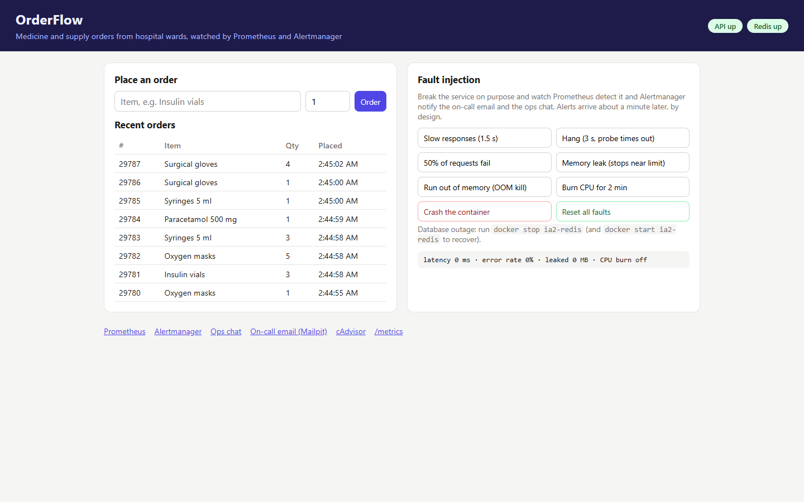

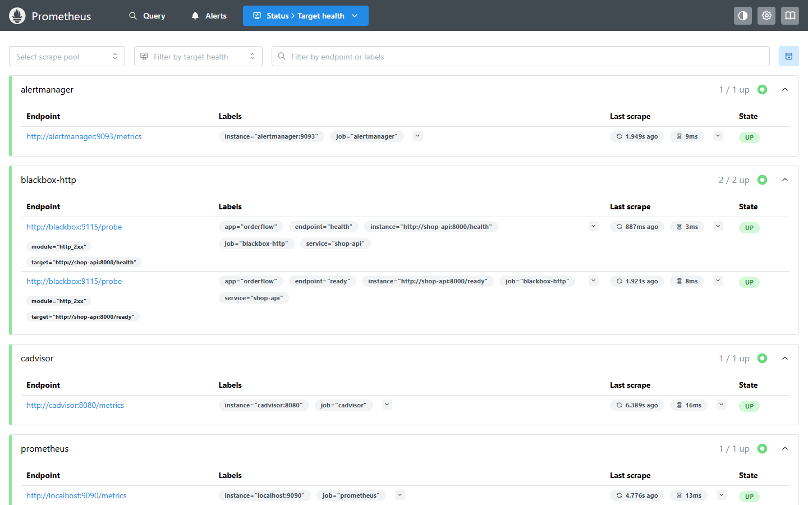

## 5.2 Three Angles of Monitoring

Effective microservice observability requires monitoring across three distinct operational layers:

**1. White-box Application Telemetry:**  
OrderFlow embeds the official `prometheus_client` Python SDK to expose application-internal telemetry at `/metrics`: request counters by route and HTTP status, request duration histograms, order creation totals, and dependency availability. Importantly, simulated application faults leave the `/metrics` endpoint responsive. This accurately mirrors real-world hangs where the web process accepts TCP connections but fails user requests.

**2. Black-box Synthetic Probing:**  
The Prometheus Blackbox Exporter probes `/health` (liveness) and `/ready` (readiness) from the outside network every 5 seconds with a 2-second timeout, recording `probe_success`. If OrderFlow hangs, the blackbox probe fails while internal Prometheus scraping still succeeds, making black-box probing essential for capturing real user impact:

```yaml
- job_name: blackbox-http
  metrics_path: /probe
  params: { module: [http_2xx] }
  static_configs:
    - targets: ["http://shop-api:8000/health"]
  relabel_configs:
    - { source_labels: [__address__], target_label: __param_target }
    - { source_labels: [__param_target], target_label: instance }
    - { target_label: __address__, replacement: blackbox:9115 }
```

**3. Container-Level Kernel Metrics:**  
Google's cAdvisor reads Linux cgroup statistics directly from the host kernel. It tracks memory consumption against container limits, CPU throttling against quota allocations, OOM kill events, and container start timestamps—even for off-the-shelf images without application metrics. A relabeling filter restricts scraping to containers prefixed with `ia2-*`.

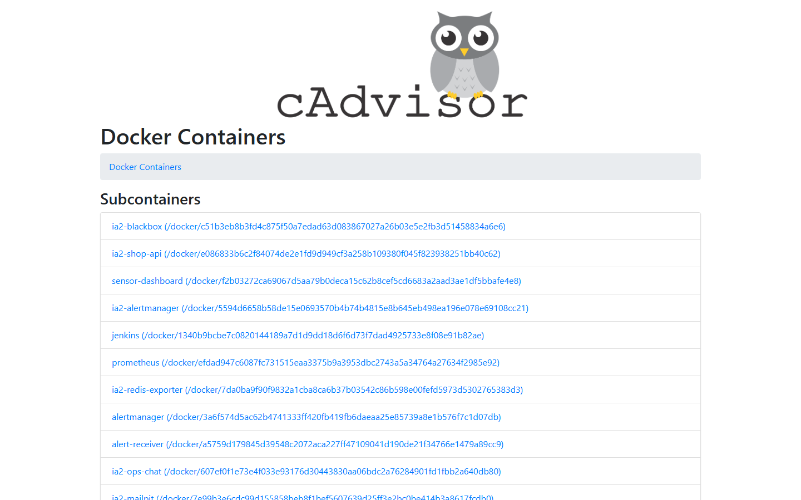

## 5.3 Alerting Rules & Logic

We defined precomputed recording rules for high-cardinality error ratios:

```yaml
- record: service:http_errors:ratio_rate1m
  expr: |
    ( sum by (app, service) (rate(http_requests_total{job="shop-api", status=~"5.."}[1m]))
        or
      sum by (app, service) (rate(http_requests_total{job="shop-api"}[1m])) * 0 )
    / sum by (app, service) (rate(http_requests_total{job="shop-api"}[1m]))
```

The `or ... * 0` syntax ensures that in healthy states when zero HTTP 5xx errors exist, the expression evaluates to `0%` rather than returning an empty vector (no data).

| Alert Rule | Evaluation Condition | Wait (`for`) | Severity |
|---|---|---|---|
| `ServiceDown` | `up == 0` | 30 s | critical |
| `EndpointDown` | `probe_success{job="blackbox-http"} == 0` | 40 s | critical |
| `DependencyDown` | `redis_up == 0 or up{job="redis"} == 0` | 15 s | critical |
| `HighErrorRate` | HTTP 5xx error ratio > 10% | 30 s | critical |
| `ContainerOOMKilled` | `increase(container_oom_events_total[5m]) > 0` | 0 s | critical |
| `ServiceNotReady` | Blackbox `/ready` probe fails | 45 s | warning |
| `HighLatencyP95` | 95th percentile latency > 500 ms | 1 m | warning |
| `ContainerMemoryNearLimit` | Working set memory > 80% of limit | 15 s | warning |
| `ContainerCPUThrottled` | Throttled CPU periods > 50% | 30 s | warning |
| `ContainerRestarted` | Container start timestamp changed in 5m | 0 s | warning |
| `Watchdog` | `vector(1)` (Always firing) | 0 s | none |

Every alert definition includes structured `summary`, `description`, and actionable `runbook` instructions detailing exact remediation steps for on-call personnel.

## 5.4 Alertmanager Pipeline & Noise Control

```yaml
route:
  receiver: ops-chat
  group_by: [alertname, service]
  group_wait: 10s
  group_interval: 30s
  repeat_interval: 3h
  routes:
    - matchers: ['alertname="Watchdog"']
      receiver: heartbeat
    - matchers: ['severity="critical"']
      receiver: oncall-email
      group_wait: 5s
      continue: true
    - matchers: ['severity=~"critical|warning"']
      receiver: ops-chat
```

Alertmanager routes alerts based on severity: critical alerts dispatch instantly to both on-call email and ops chat (`continue: true`), warnings post exclusively to ops chat, and the constant `Watchdog` routes to a dead man's snitch heartbeat receiver.

To prevent alert fatigue, Alertmanager implements three **inhibition rules**:
- When `DependencyDown` (Redis failure) fires, it suppresses `HighErrorRate`, `HighLatencyP95`, and `ServiceNotReady`.
- When `ServiceDown` fires, it suppresses `EndpointDown` and derivative warnings.
- When `EndpointDown` fires, it suppresses downstream latency and readiness alerts.

Crucially, inhibition requires that the root cause alert fires *before* secondary symptom alerts. We deliberately configured the root cause (`DependencyDown`) with a shorter wait duration (`for: 15s`) than the downstream symptoms (`HighErrorRate` with `for: 30s`).

## 5.5 Failure Injection & Operational Dashboards

Failures were injected systematically using OrderFlow's built-in chaos endpoints, PowerShell automation scripts (`scripts/chaos.ps1`), and direct container lifecycle events:

| Failure Mode | Injection Mechanism | Detection Mechanism |
|---|---|---|
| API Error Spike | 50% of requests return HTTP 500 | `HighErrorRate` from white-box counters |
| High Latency | Injects 1.5 s artificial delay | `HighLatencyP95` from histogram buckets |
| Web Service Hang | Injects 3.0 s delay exceeding probe timeout | `EndpointDown` via blackbox probe (`up` stays 1) |
| Memory Leak | Allocates RAM at 5 MB/s up to 85% limit | `ContainerMemoryNearLimit` from cAdvisor |
| Out of Memory (OOM) | Rapid allocation at 40 MB/s exceeding limit | `ContainerOOMKilled` via kernel OOM counter |
| CPU Exhaustion | Spawns two busy compute threads | `ContainerCPUThrottled` via cgroup quota counter |
| Container Crash | Immediate process termination and restart | `ContainerRestarted` via cAdvisor start time |
| Database Outage | `docker stop ia2-redis` | `DependencyDown` via Redis exporter |
| Total Service Outage | `docker stop ia2-shop-api` | `ServiceDown` via Prometheus scrape failure |

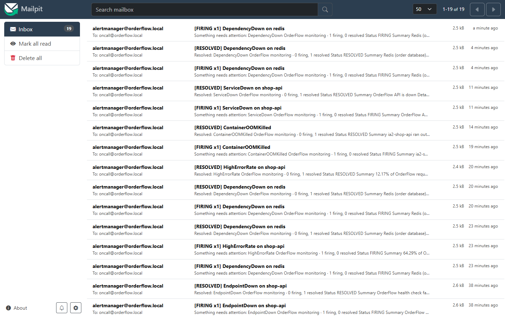

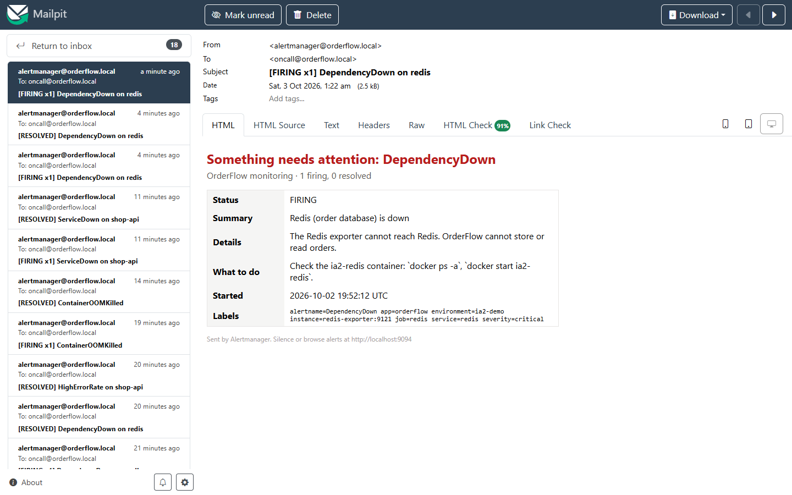

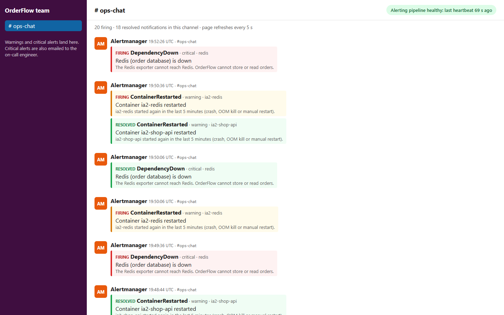

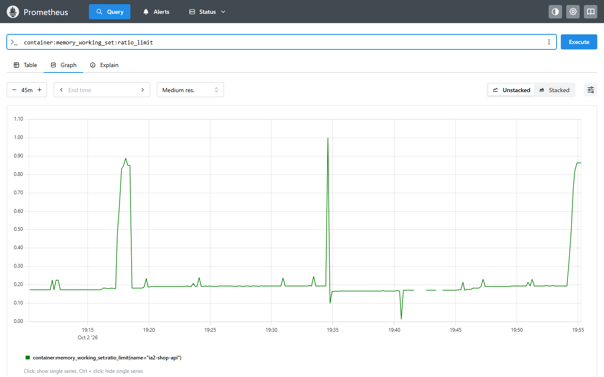

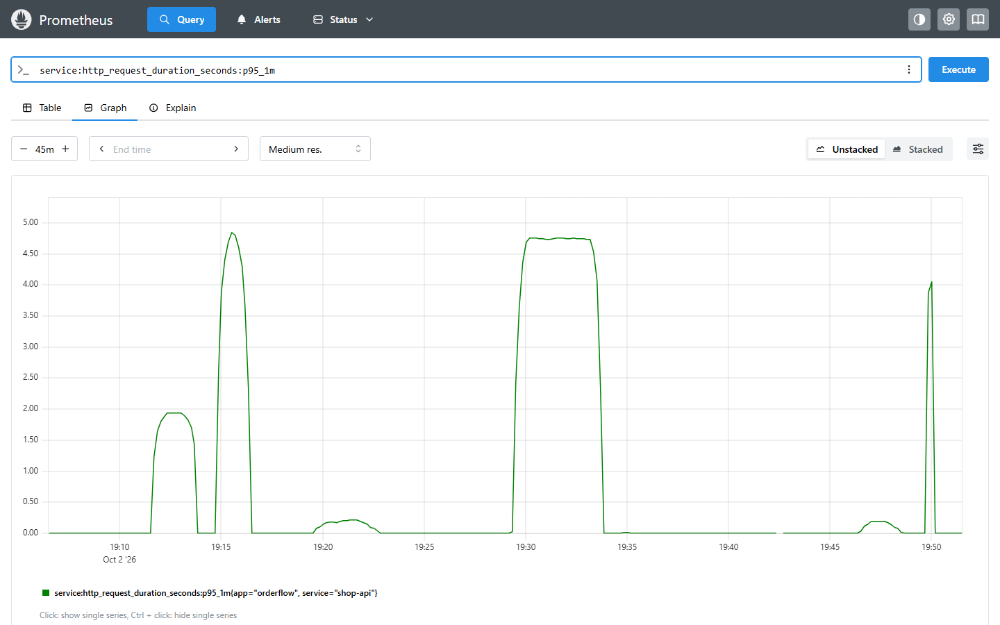

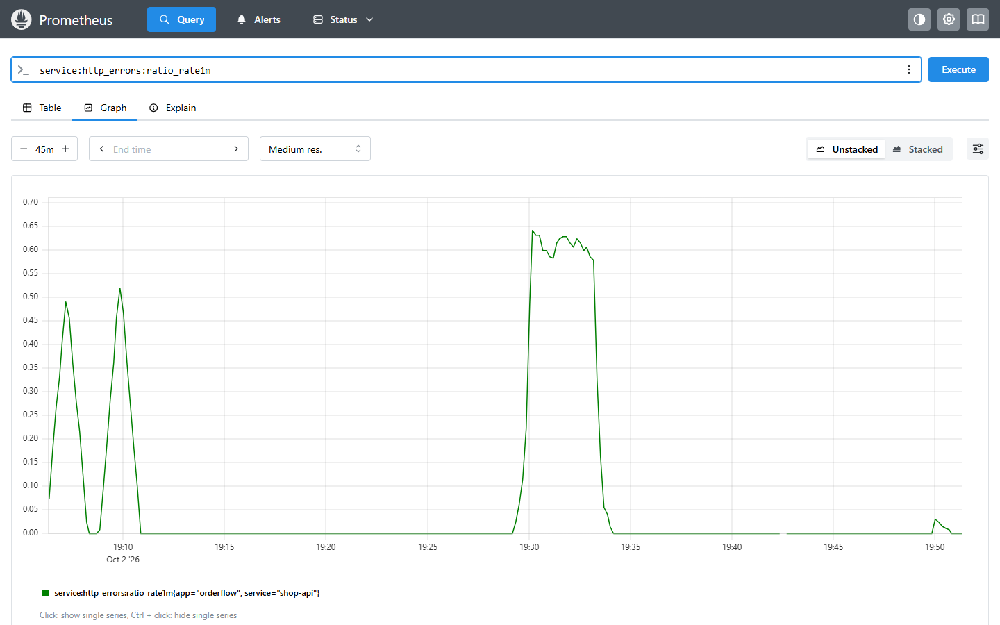

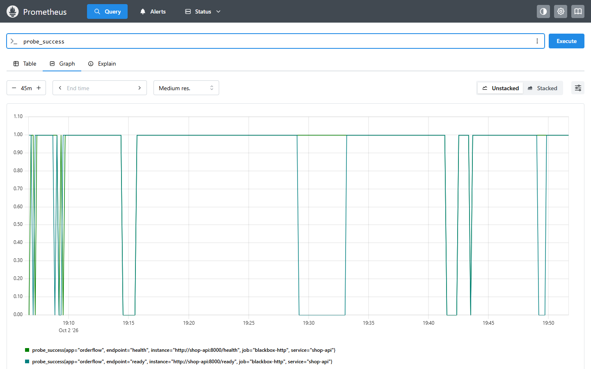

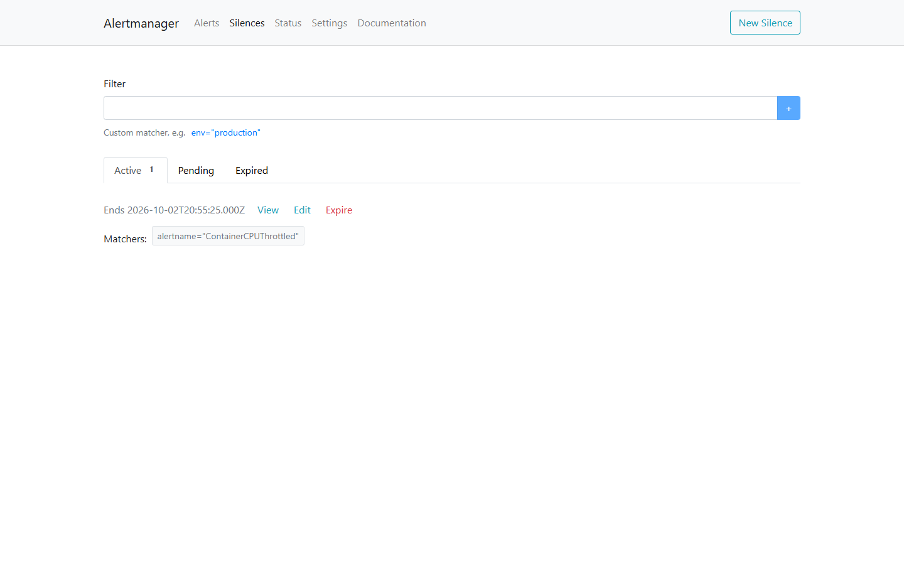

# 6. Comparison and evaluation

## 6.1 Detection and Recovery Performance

We executed `scripts/measure_detection.py` to benchmark end-to-end detection latency across all nine failure modes on a standard developer workstation (Docker Desktop, 20 vCPUs, 8 GB memory allocation). The benchmark measured the exact duration from fault injection to the first alert notification in Ops Chat and Mailpit, as well as the duration to the `RESOLVED` notification following remediation.

| Failure Mode Injected | Triggered Alert | Severity | Ops Chat Latency | On-Call Email Latency | Recovery Notification |
|---|---|---|---|---|---|
| API Error Spike (50% failure rate) | `HighErrorRate` | critical | 64 s | 59 s | 57 s |
| High Response Latency (1.5 s delay) | `HighLatencyP95` | warning | 90 s | — | 56 s |
| Service Hang (Probe timeout) | `EndpointDown` | critical | 60 s | 55 s | 26 s |
| Gradual Memory Leak (~85% RAM) | `ContainerMemoryNearLimit` | warning | 72 s | — | 26 s |
| CPU Exhaustion (Saturated quota) | `ContainerCPUThrottled` | warning | 76 s | — | 56 s |
| Database Outage (`docker stop ia2-redis`) | `DependencyDown` | critical | 32 s | 27 s | 26 s |
| Out Of Memory (`OOMKilled`) | `ContainerOOMKilled` | critical | 31 s | 26 s | 296 s ¹ |
| Process Crash & Restart | `ContainerRestarted` | warning | 16 s | — | — ² |
| Full Outage (`docker stop ia2-shop-api`) | `ServiceDown` | critical | 52 s | 47 s | 27 s |

¹ `ContainerOOMKilled` computes events over a 5-minute sliding window; it naturally clears 5 minutes after the incident.  
² Container restarts are discrete point-in-time events; the warning clears automatically after 5 minutes.

All nine failure types were detected reliably. Total time-to-detect corresponds to the mathematical sum of four intentional latency stages: the scrape interval (5 s), the moving average smoothing window (e.g. 1-minute `rate()`), the rule's `for` pending duration, and Alertmanager's `group_wait`.

- **Fastest Detection:** Container restart (16 s) because restarts represent factual discrete events requiring no `for` duration.
- **Controlled Latency:** P95 latency alerts require 90 s to allow metric windows to reflect true user impact rather than transient blips.
- **Priority Dispatch:** Critical alerts reached the on-call inbox 5 seconds earlier than Ops Chat due to a prioritized `group_wait: 5s`.
- **Automatic Incident Resolution:** All remediated failures dispatched `RESOLVED` notifications within 26 to 57 seconds.

**Engineering Lessons from Initial Test Runs:**
Our initial test run (`docs/results/run1.log`) identified two real-world failure dynamics that shaped our final configuration:
1. *CPU Alert Flapping:* Comparing raw CPU rate against container quota resulted in volatile values (fluctuating between 40% and 100%) due to scrape jitter. We replaced raw utilization with **cgroup throttled period ratios** (`container_cpu_cfs_throttled_periods_total / container_cpu_cfs_periods_total`), which provided a stable 100% reading during saturation.
2. *Exporter Scrape Timeout:* During the Redis outage, the Redis exporter blocked for 15 seconds attempting connection, exceeding Prometheus's 4-second scrape timeout. Instead of reporting `redis_up = 0`, the scrape returned no data, causing the alert to flap. We reduced the exporter connection timeout to 1 second and updated the PromQL expression to `redis_up == 0 or up{job="redis"} == 0`, ensuring missing metrics trigger alerting.

## 6.2 Noise Reduction & Alert Suppression

Alertmanager's inhibition rules successfully prevented notification floods during multi-symptom failures:

| Incident | Alerts Firing in Prometheus | Notifications Dispatched | Suppressed Symptoms |
|---|---|---|---|
| Redis Database Outage | `DependencyDown`, `HighErrorRate`, `ServiceNotReady`, `HighLatencyP95` | **DependencyDown only** (1 email, 1 chat) | `HighErrorRate`, `ServiceNotReady`, `HighLatencyP95` |
| OrderFlow Full Outage | `ServiceDown`, `EndpointDown`, `ServiceNotReady`, `ContainerRestarted` | **ServiceDown** (email + chat); `ContainerRestarted` (chat) | `EndpointDown`, `ServiceNotReady` |
| Application Process Hang | `EndpointDown`, `ServiceNotReady` | **EndpointDown** (email + chat) | `ServiceNotReady` |

Instead of receiving four disjointed alarm messages, the on-call engineer received exactly one clear email identifying the root cause: the database dependency failure.

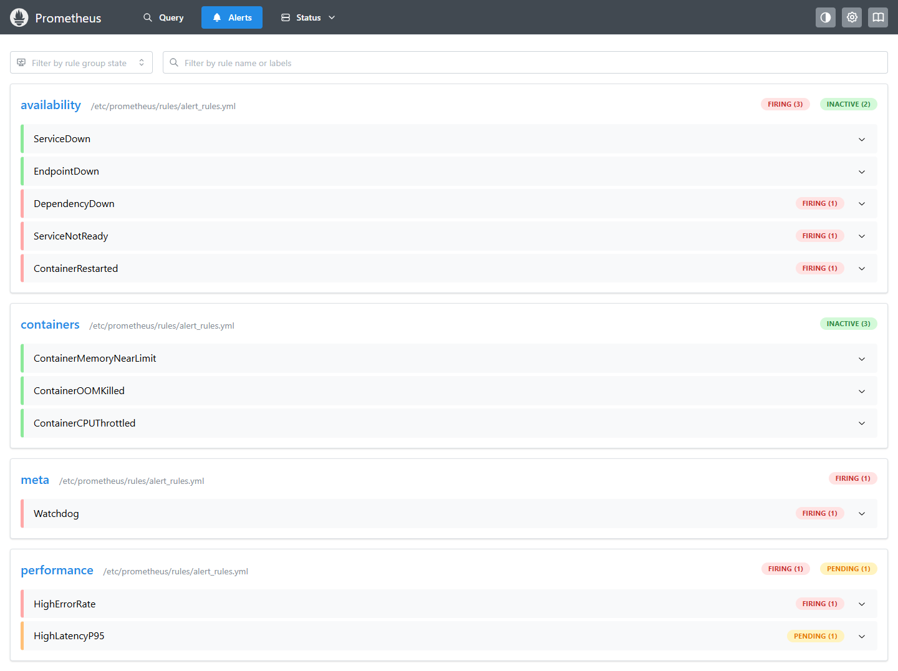

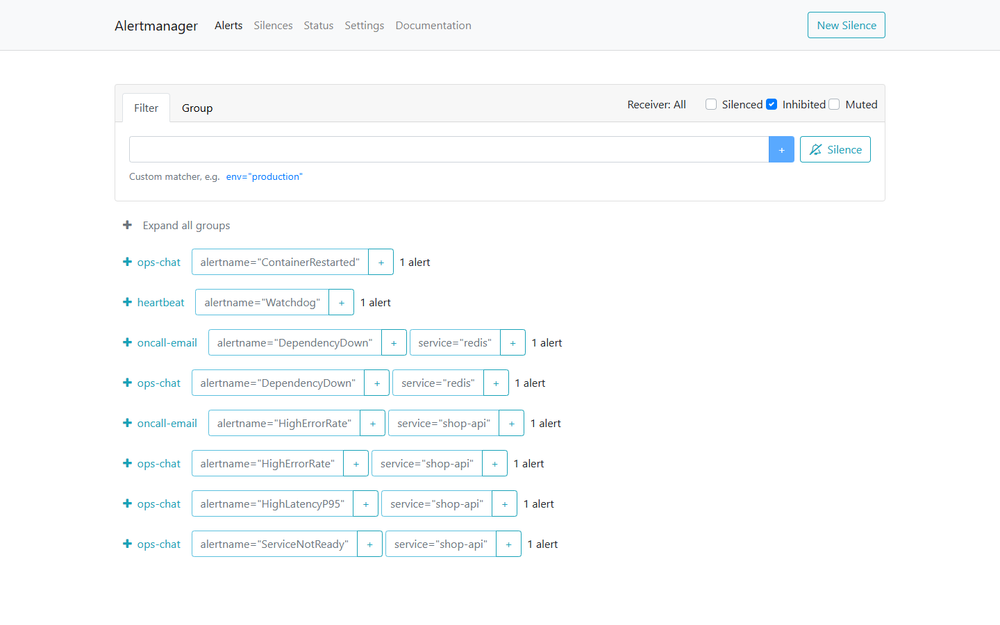

## 6.3 False-Positive Resilience

To evaluate resilience against transient spikes, we stopped OrderFlow for exactly 10 seconds and immediately resumed it. **Zero critical alerts were dispatched.** The 30-second `for` wait window absorbed the temporary disruption, while a single informational `ContainerRestarted` warning logged the event in Ops Chat. This behavior is formally enforced in our CI pipeline via a `promtool` unit test asserting that 10-second outages never page engineers.

## 6.4 Resource Footprint

Resource utilization was measured using `docker stats` under active customer traffic:

| Container | CPU Utilization | Memory Usage |
|---|---|---|
| `ia2-prometheus` | 2.2% | 77 MiB |
| `ia2-shop-api` | 2.8% | 46 MiB |
| `ia2-alertmanager` | 0.4% | 34 MiB |
| `ia2-cadvisor` | 3.4% | 30 MiB |
| `ia2-blackbox` | 1.0% | 26 MiB |
| `ia2-mailpit` | 0.0% | 24 MiB |
| `ia2-ops-chat` | 0.0% | 14 MiB |
| `ia2-traffic` | 1.2% | 14 MiB |
| `ia2-redis-exporter` | 0.8% | 13 MiB |
| `ia2-redis` | 0.7% | 10 MiB |

The entire observability infrastructure (Prometheus, Alertmanager, cAdvisor, and exporters) consumed **less than 180 MiB of RAM and approximately 8% of one CPU core** while indexing over 3,080 active time series, demonstrating that robust observability requires minimal overhead.

## 6.5 Comparative Tool Analysis

| Evaluation Metric | Prometheus + Alertmanager | Nagios Core | Zabbix | Datadog | Grafana Alerting | AWS CloudWatch |
|---|---|---|---|---|---|---|
| **Licensing & Cost** | Open Source (Apache 2.0) | Open Source (GPL) | Open Source (AGPL) | Commercial SaaS (Host-based) | Open Source / Cloud | Commercial Pay-per-Metric |
| **Telemetry Ingestion** | Pull over HTTP + Exporters | Active Plugin Checks | Agent Push/Pull, SNMP | Agent Push to SaaS | Querying Existing Sources | AWS Agent Push |
| **Container Native** | Native Service Discovery | Poor (Static Hosts) | Moderate (Agent 2) | High (Auto-discovery) | Dependent on Source | Container Insights (ECS/EKS) |
| **Alert Expressiveness** | PromQL (Ratios, p95) | Static Thresholds | Trigger Expressions | Metric Query Language | Multi-datasource Queries | Metric Math & Alarms |
| **Noise Suppression** | Inhibition, Grouping, Silences | Escalation Trees | Trigger Dependencies | Downtimes & Monitors | Notification Policies | Alarm SNS Topics |
| **Config as Code** | Declarative YAML in Git | Text Config Files | Database / UI / API | Terraform / API | Provisioning Files | CloudFormation / Terraform |
| **Logs & Tracing** | Metrics only (Pair with Loki/Tempo) | None | Limited | Fully Integrated | Integrated via Loki/Tempo | CloudWatch Logs & X-Ray |
| **Long-Term Storage** | Local TSDB (Thanos/Mimir) | External RDBMS | SQL Database | Managed Cloud Storage | Dependent on Source | Managed AWS Storage |

For self-hosted container failure detection with zero software licensing costs and Git-based rule validation, Prometheus and Alertmanager represent the industry standard.

## 6.6 Strengths and Limitations

**Strengths Observed:**
- **Unified PromQL Engine:** A single mathematical query language powers dashboards, recording rules, and alert thresholds.
- **Alerting as Tested Code:** Alert rules are versioned in Git, verified with `promtool` unit tests, and smoke-tested in CI before deployment.
- **Intelligent Noise Suppression:** Hierarchical inhibition rules turn cascade failures into a single root-cause notification.
- **Lightweight Operational Footprint:** Full containerized monitoring operates comfortably within ~180 MiB of RAM.

**Limitations & Trade-offs:**
- **Metrics Only:** Prometheus captures numerical trends but requires supplementary tools like Loki or Jaeger to inspect raw logs and distributed traces.
- **Intentional Detection Latency:** Detection takes 15–90 seconds due to scrape cycles and wait durations designed to prevent false alarms.
- **High Availability Complexity:** Redundancy requires deploying dual Prometheus servers scraping identical targets and clustered Alertmanagers.
- **PromQL Learning Curve:** Complex vector matching, label joining, and handling empty sets require deep operational familiarity.

# 7. Testing and Continuous Integration

We treated alerting configuration with the same rigor as production application code. An untested alert rule or misconfigured routing pipeline is as dangerous as a software bug: if an alert fails to fire or route correctly, the team will not learn about the next outage until users report it.

Every commit and pull request triggers our automated GitHub Actions CI/CD pipeline (`.github/workflows/ci.yml`), which executes three defensive validation stages:

1. **Unit & Syntax Validation:** Runs Python unit tests for OrderFlow (20 tests) and the alert receiver (6 tests), checks rule syntax with `promtool check rules`, and statically validates Alertmanager routing syntax with `amtool config check`.
2. **Alert Rule Unit Testing:** Executes `promtool test rules` against `monitoring/prometheus/alert_rules_test.yml`. These tests inject synthetic time-series data and assert that alert rules trigger exactly as expected, including edge cases:
   - Proving that a 10-second outage does *not* fire `ServiceDown` (absorbing transient network blips).
   - Proving that unconstrained containers without memory limits do not trigger false `ContainerMemoryNearLimit` alerts.
   - Asserting routing decisions with `amtool config routes test` for critical, warning, and heartbeat alerts.
3. **End-to-End Smoke Test:** Deploys all 10 containers in GitHub Actions runners via `docker compose up -d`, polls all 7 targets until healthy, waits for the initial Watchdog heartbeat, injects a 50% API error rate fault, and verifies programmatically that Alertmanager dispatches the `HighErrorRate` alert to both the Mailpit email inbox and the Ops Chat webhook.

| Validation Layer | Tool / Scope | What is Verified |
|---|---|---|
| OrderFlow Application | `pytest` (20 tests) | In-memory store API endpoints, `/health` and `/ready` probes, Prometheus metric exposition, and fault injection hooks |
| Prometheus Rules | `promtool check rules` & `test rules` (8 test suites) | PromQL syntax, recording rule math, alert firing logic, label evaluation, and suppression of transient blips |
| Alertmanager Routing | `amtool config check` & `routes test` | Notification tree traversal, severity routing, grouping keys, and template syntax |
| Ops Chat Receiver | `unittest` (6 tests) | Webhook payload parsing, severity filtering, and Watchdog heartbeat detection |
| End-to-End Stack | GitHub Actions CI runner | Full Docker Compose spin-up, synthetic traffic generation, live fault injection, and alert delivery to email and chat |

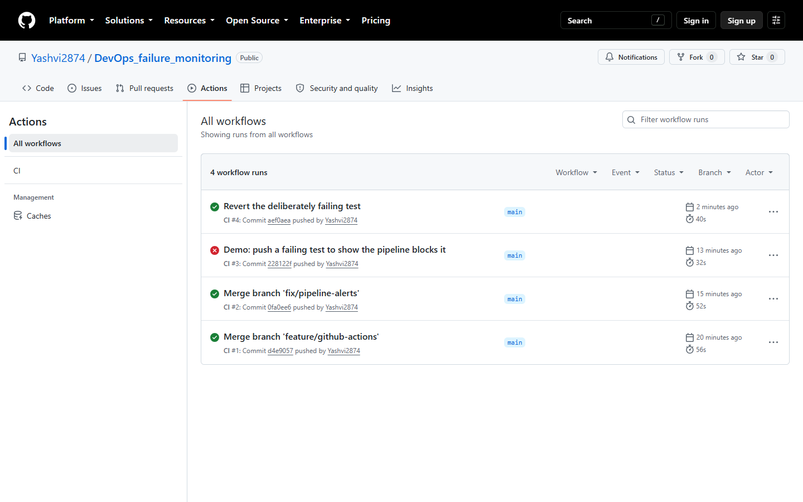

# 8. Project Links and Artifacts

All project artifacts, including source code, configuration files, automated test suites, and the recorded video demonstration, are publicly accessible at the following repositories:

- **GitHub Repository:**  
  [https://github.com/Yashvi2874/DevOps_IA2](https://github.com/Yashvi2874/DevOps_IA2)  
  Contains the complete source code of the OrderFlow microservice, Docker Compose configuration (`docker-compose.yml`), Prometheus rules and scrape configs, Alertmanager routing and templates, synthetic traffic generator, chaos fault injection scripts, and GitHub Actions CI workflow.

- **Demonstration Video & Presentation (Google Drive):**  
  [https://drive.google.com/drive/folders/11pqw2HeYxWI5QLId-3zkHv1x-a_rm6BP?usp=sharing](https://drive.google.com/drive/folders/11pqw2HeYxWI5QLId-3zkHv1x-a_rm6BP?usp=sharing)  
  Contains the recorded presentation slides and live 4-minute demonstration showcasing failure injection, metrics visualization in Prometheus, silence management, symptom inhibition in Alertmanager, and real-time alert delivery in Mailpit and Ops Chat.

# 9. Conclusion

Prometheus and Alertmanager successfully detected every failure injected across our containerized microservice stack, from total service shutdowns and hung processes to memory leaks, CPU quota saturation, and database crashes hidden behind running web containers. Every failure was converted into an actionable alert notification delivered to the appropriate channel within 90 seconds, followed by automatic recovery confirmations.

The central insight of this case study is that raw failure detection is insufficient on its own. In production environments, noise suppression through intelligent grouping, hierarchical inhibition, and deliberate evaluation wait times represents the difference between a high-signal alerting system and debilitating alert fatigue. Supported by configuration as code, automated unit testing with `promtool`, and end-to-end CI verification, Prometheus and Alertmanager provide a battle-tested foundation for container observability.

# 10. References

1. Prometheus Authors, *Prometheus Documentation: Concepts, Querying, and Alerting*, 2026. <https://prometheus.io/docs/>
2. Prometheus Authors, *Alertmanager Notification Architecture and Routing Configuration*, 2026. <https://prometheus.io/docs/alerting/latest/alertmanager/>
3. Prometheus Community, *Blackbox Exporter: HTTP, HTTPS, DNS, TCP and ICMP Probing*, <https://github.com/prometheus/blackbox_exporter>
4. Google Inc., *cAdvisor: Core Architecture and Container Metrics Collection*, <https://github.com/google/cadvisor>
5. Oliver006, *Redis Exporter for Prometheus Metrics*, <https://github.com/oliver006/redis_exporter>
6. Prometheus Authors, *Official Python Client for Prometheus Telemetry*, <https://github.com/prometheus/client_python>
7. Axllent, *Mailpit: Email Testing and SMTP Inspection Tool*, <https://mailpit.axllent.org/>
8. B. Beyer, C. Jones, J. Petoff, and N. R. Murphy, *Site Reliability Engineering: How Google Runs Production Systems*, O'Reilly Media, 2016: Chapter 6, "Monitoring Distributed Systems".
9. Industry Observability Specifications: Nagios Core, Zabbix Enterprise, Datadog Cloud Telemetry, Grafana Alerting, and AWS CloudWatch documentation (accessed October 2026).
